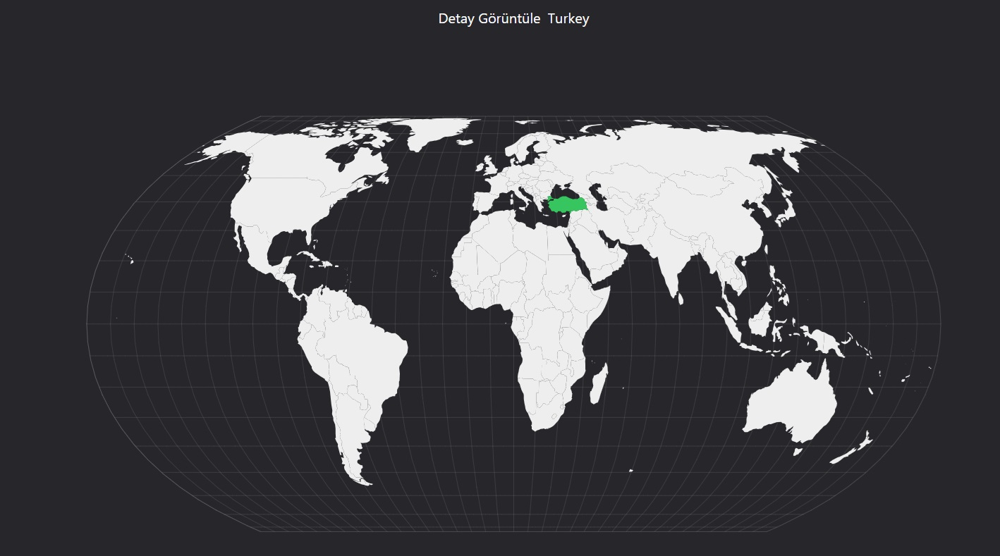
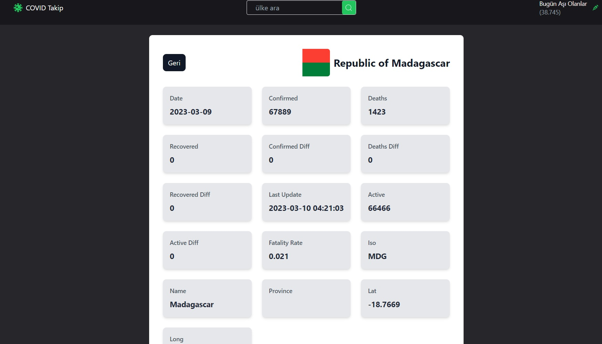

# React_CovidMap_App

This React-based application provides real-time global tracking of COVID-19 cases through an interactive map, developed using react-simple-maps. Users can view up-to-date statistics on cases, recoveries, and deaths for each country, with data visualizations updated daily. The app features a responsive design using Tailwind CSS and leverages Redux Toolkit for state management. It has undergone unit testing with Jest and React Testing Library to ensure accuracy and reliability.

# Tools and Libraries Used

- react-router-dom
- react-icons
- tailwind
- react-simple-maps
- @reduxjs/toolkit
- react-redux
- @testing-library/user-event@14.0
- axios@^0.27.2
- react-testing-library
- jest
- thunk

# Screenshots

## Gif

# API

- Covid data: available here: https://rapidapi.com/axisbits-axisbits-default/api/covid-19-statistics

- Country data: available here: https://restcountries.com/

# Live Project

https://covid-map-unit-test.vercel.app/
